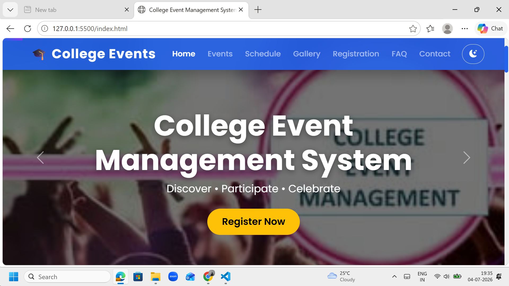
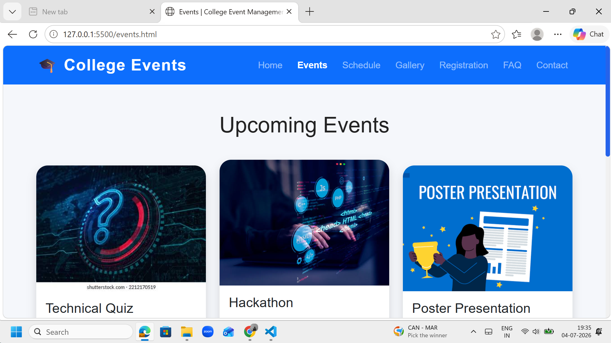
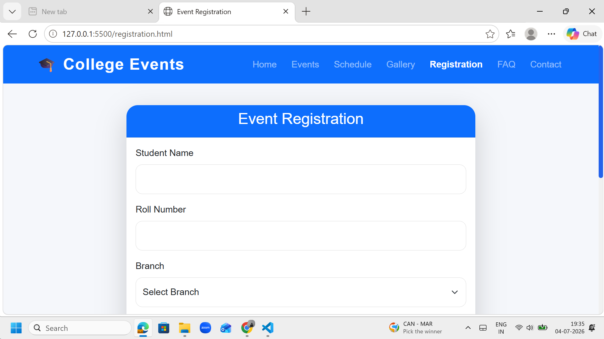
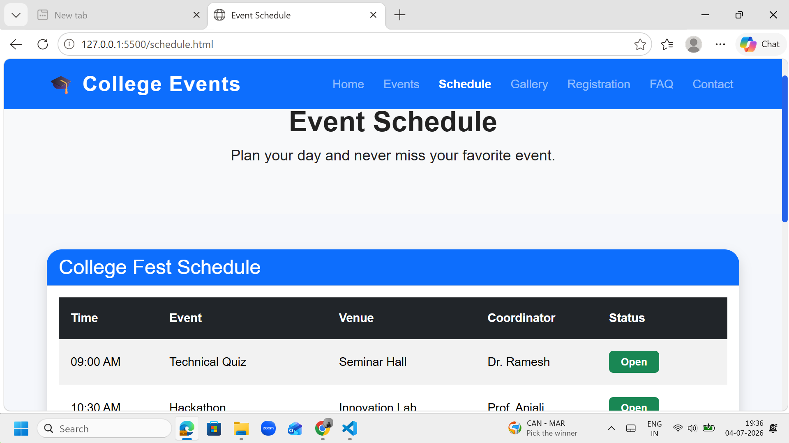
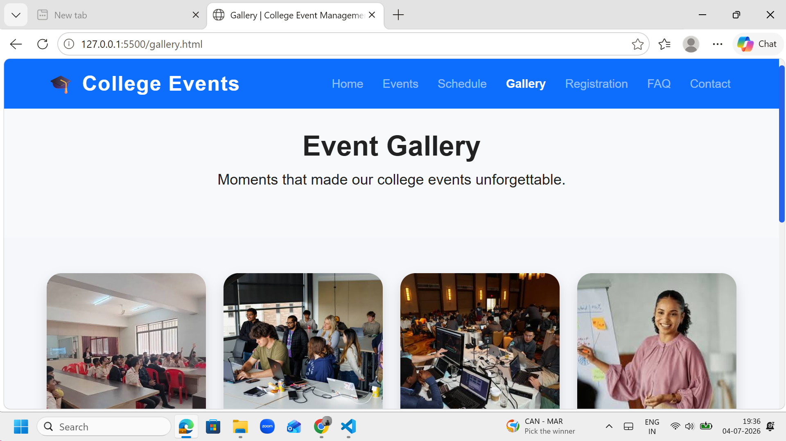
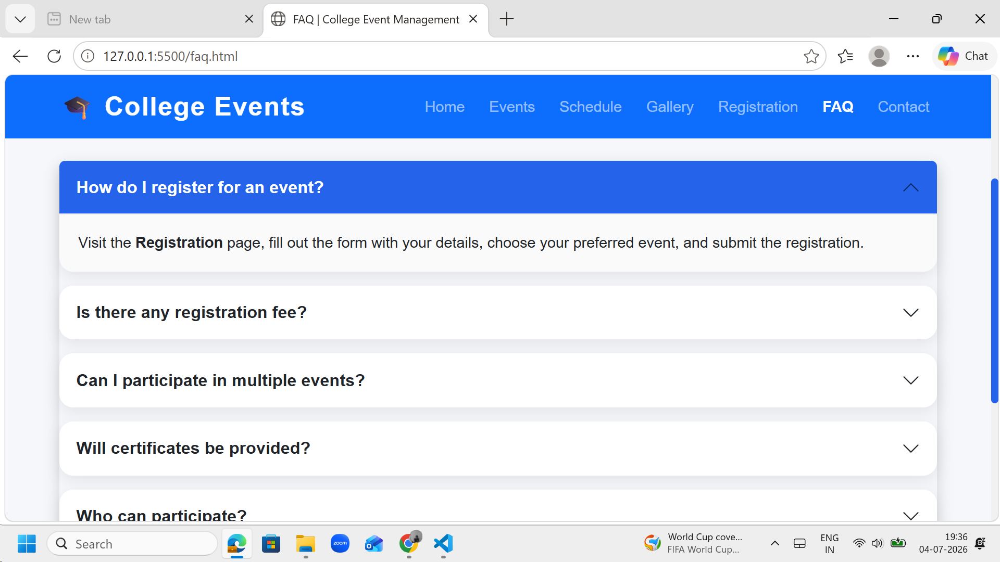
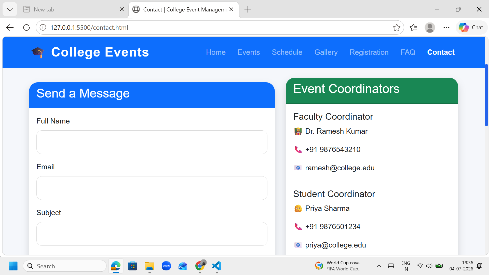

# 🎓 College Event Management System

A responsive and modern **College Event Management System** built using **HTML, CSS, Bootstrap, and JavaScript**. This project allows students to explore college events, register for competitions, view event schedules, browse galleries, and contact event coordinators through an intuitive and user-friendly interface.

---

## 📌 Project Overview

The College Event Management System is designed to simplify the management of college events while providing students with a seamless experience to discover and participate in technical and cultural activities.

The application features a modern responsive design, interactive UI components, smooth animations, and multiple pages built using Bootstrap.

---

## ✨ Features

* 🏠 Responsive Home Page
* 🎠 Bootstrap Carousel
* 🌈 Modern Gradient Hero Section
* 📊 Animated Statistics Counter
* ⭐ Featured Event Section
* ⏳ Live Countdown Timer
* 📅 Event Schedule
* 🎯 Events Page with Bootstrap Cards
* 📝 Event Registration Form
* ✅ Registration Success Message
* 🖼️ Responsive Gallery
* ❓ FAQ Section using Bootstrap Accordion
* 📞 Contact Page
* 📍 Embedded Google Map
* 🌙 Dark Mode
* 📈 Scroll Progress Bar
* ⬆️ Back to Top Button
* ✨ AOS Scroll Animations
* 📱 Fully Responsive Design

---

## 🛠️ Technologies Used

* HTML5
* CSS3
* Bootstrap 5
* JavaScript (ES6)
* Bootstrap Icons
* Google Fonts (Poppins)
* AOS (Animate On Scroll)

---

## 📂 Project Structure

```text
college-event-management/
│
├── index.html
├── events.html
├── registration.html
├── schedule.html
├── gallery.html
├── faq.html
├── contact.html
│
├── css/
│   └── style.css
│
├── js/
│   └── script.js
│
├── images/
│   ├── banner1.jpg
│   ├── banner2.jpg
│   ├── banner3.jpg
│   ├── gallery1.jpg
│   ├── gallery2.jpg
│   ├── gallery3.jpg
│   ├── gallery4.jpg
│   ├── gallery5.jpg
│   ├── gallery6.jpg
│   ├── gallery7.jpg
│   ├── gallery8.jpg
│   └── ...
│
└── README.md
```

---

## 📸 Screenshots

### 🏠 Home Page



### 🎯 Events Page



### 📝 Registration Page



### 📅 Schedule Page



### 🖼️ Gallery Page



### ❓ FAQ Page



### 📞 Contact Page



## 🚀 How to Run the Project

1. Clone the repository

git clone https://github.com/KeerthiKumar03/college-event-management-system.git


2. Open the project folder.

3. Open `index.html` in your browser or use the VS Code Live Server extension.


## 🎯 Learning Outcomes

During this project, I gained hands-on experience with:

* Responsive Web Design
* Bootstrap Components
* Grid System
* Bootstrap Carousel
* Cards
* Forms
* Tables
* Accordions
* Responsive Images
* JavaScript DOM Manipulation
* Event Handling
* Local Storage
* CSS Animations
* Responsive Layout Techniques
* UI/UX Design Principles


## 🔮 Future Enhancements

* 🔐 User Authentication
* 🗄️ Database Integration
* 💳 Online Event Registration
* 📧 Email Notifications
* 📱 Progressive Web App (PWA)
* 🎟️ QR Code Event Passes
* 🏆 Leaderboard
* 🔍 Event Search & Filters
* ❤️ Favorite Events
* 👤 Student Dashboard
* 🛠️ Admin Dashboard


## 👨‍💻 Developed By

**Keerthi Kumar Goud**

B.Tech – Computer Science Engineering

Passionate about Full Stack Development, Data Structures & Algorithms, and building modern web applications.


## ⭐ If you found this project useful, consider giving it a Star!

Thank you for visiting this repository.
